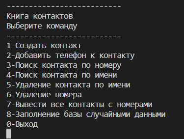
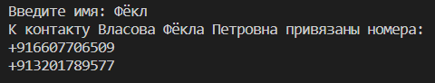
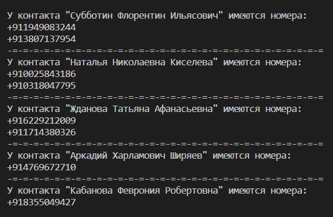

<h3>Тестовое задание на позицию Junior Python</h3>

#Реализовать телефонный справочник со следующими возможностями:
1. Вывод постранично записей из справочника на экран
2. Добавление новой записи в справочник
3. Возможность редактирования записей в справочнике
4. Поиск записей по одной или нескольким характеристикам
   
#Требования к программе:
1. Реализация интерфейса через консоль (без веб- или графического интерфейса)
2. Хранение данных должно быть организовано в виде текстового файла, формат которого придумывает сам программист
3. В справочнике хранится следующая информация: фамилия, имя, отчество, название организации, телефон рабочий, телефон личный (сотовый)

#Плюсом будет:
1. аннотирование функций и переменных
2. документирование функций
3. подробно описанный функционал программы
4. размещение готовой программы и примера файла с данными на github_

#В результате выполнения тестового задания, разработан код на Python, реализующий функции книги контактов.
 - выполнен минимальный консольный интерфейс
   
 - в качестве СУБД выбран sqlite, реализация с помощью sqlalchemy
 - имеется возможность создавать, просматривать и удалять контакты из БД, а также добавлять неограниченное количество телефонных номеров к контакту;
 - имеется возможность поиска контакта по части имени/номера
   
 - имеется функция отображения всех контактов в БД
 - с помощью модуля Faker имеется возможность генерирования случайных контактов, имеющих до 3 случайных номеров телефонов
   
